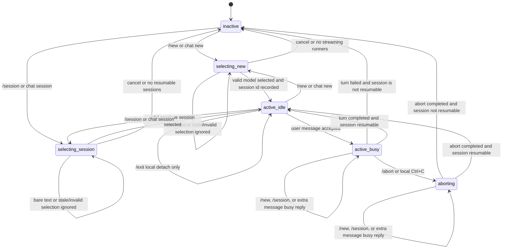

# TickClaw Agent Notes

This file is the shared development guide for Codex, Claude, Gemini, and other coding agents working on TickClaw.

User-facing usage belongs in `README.md`. Internal design rules, implementation constraints, and future development notes belong here.

## Project Goal

TickClaw is a file-managed scheduler for agent tasks. It should stay small, inspectable, and easy to manage over code agent cli such as codex, claude, or telegram bridged code agent cli.

Core principles:

- Tasks are files under `~/.tickclaw/tasks/`.
- TickClaw does not use Linux `cron`; it uses its own daemon loop with local-time cron expressions parsed by the Rust `croner` crate.
- TickClaw does not require MCP for task management.
- The CLI is the primary command surface.
- Telegram commands must map to most of local CLI commands.
- Runtime state is stored beside each task, not in a central database.

## Architecture

```text
TickClaw daemon/Codex/Claude/Telegram bridged(Codex/Claude/...)
            |
            v
~/.tickclaw/tasks/*/task.yaml
            |
            v
 shell runner / Codex runner -> stdout
            |
            v
 logs/ + state.json + Telegram notification
```

## CLI Commands

```bash
tickclaw init                                # create the TickClaw configuration directory (~/.tickclaw), including config file, and example tasks
tickclaw daemon                              # start the scheduler loop and run due tasks
tickclaw check                               # validate all TickClaw-controlled files under ~/.tickclaw, including config.yaml and task.yaml files
tickclaw telegram '<message>'                # send a Telegram text message using local config
tickclaw telegram --photo <path>             # send a Telegram photo; accepts optional --caption '<message>'
tickclaw telegram --document <path>          # send a Telegram document; accepts optional --caption '<message>'

tickclaw task list                           # list all tasks and their latest status
tickclaw task run <task>                     # run one task immediately through the task-management command surface
tickclaw task status <task>                  # show task details, latest state, and a log preview
tickclaw task enable <task>                  # set enabled: true in the task.yaml file
tickclaw task disable <task>                 # set enabled: false in the task.yaml file
```

## Repository Layout

```text
TickClaw/
  README.md      # user-facing usage and project overview
  AGENTS.md      # internal development guide for code agents
  Cargo.toml     # Rust package metadata and dependencies
  skills/        # installed-TickClaw operation/configuration skills usable by Codex, Claude, and Gemini
  src/           # TickClaw Rust source code
    main.rs      # CLI parsing and top-level command dispatch
    config.rs    # TickClaw home directory and config loading/init
    task.rs      # task.yaml schema, defaults, and validation
    scheduler.rs # daemon loop, cron scheduling, task scanning, and run orchestration
    runner.rs    # shell and Codex task execution, logging, timeouts, and session extraction
    telegram.rs  # Telegram message sender and run notifications
    state.rs     # per-task state.json model and persistence
    lock.rs      # per-task lock file acquisition and cleanup
  templates/     # files copied into initialized TickClaw configurations by `tickclaw init`
    config.yaml  # example local config without secrets
    tasks/       # example task directories
```

## Configuration Layout

```text
~/.tickclaw/
  config.yaml           # local TickClaw config and Telegram secrets
  telegram_state.json   # Telegram polling offset state written by TickClaw
  tickclaw.log          # daemon-level log file
  tasks/                # task directories managed by files
    smoke-task/    # on-demand or low-frequency agent task for deeper repository inspection
      data/        # task execution or sub-agent-owned working data
      task.yaml    # task definition and schedule
      agent.md     # prompt for agent task runners
      logs/        # per-run logs written by TickClaw
      state.json   # latest task runtime state written by TickClaw
    regular-check/ # recurring shell task for cheap repository health and scheduler checks
      data/        # task execution or sub-agent-owned working data
      task.yaml    # task definition and schedule
      run.sh       # shell script executed by shell runner
      logs/        # per-run logs written by TickClaw
      state.json   # latest task runtime state written by TickClaw
```

Task-owned files:

- `task.yaml`
- `agent.md`
- `run.sh`

Runtime-owned files:

- `state.json`
- `logs/`
- `.tickclaw.lock`
- `~/.tickclaw/telegram_state.json`

Task execution or sub-agent-owned files:

- `data/`

Agents should generally edit task-owned files only. Do not manually rewrite runtime-owned files or task data unless explicitly debugging state corruption or task output issues.

## Task.yaml format

Agent task:

```yaml
name: smoke-task # task name; should match the task directory when possible
enabled: false # agent tasks should be opt-in or low-frequency unless cost is intentional
schedule: "0 9 * * *" # local-time cron expression; five fields are normalized with leading seconds
runner: gpt-5.3-codex-spark # code_agents key used to run this agent task
type: agent # task kind; agent tasks read agent.md as prompt
session: independent # independent starts fresh; reuse resumes the previous supported session
timeout: 3600 # maximum run time in seconds
```

Shell task:

```yaml
name: regular-check # task name; should match the task directory when possible
enabled: true # whether the daemon should run this task on schedule
schedule: "*/10 * * * *" # local-time cron expression; cheap shell check every 10 minutes here
type: command # task kind; command tasks execute run.sh
timeout: 1800 # maximum run time in seconds
```

Every task runs inside its own task directory, `~/.tickclaw/tasks/<task-name>/`.

Common task fields:

- `name`: task name; should match the task directory when possible.
- `enabled`: whether the daemon should run this task on schedule.
- `schedule`: quoted local-time cron expression; five fields are normalized with leading seconds. Cron expressions in YAML examples and templates must always be quoted because unquoted `*` can be parsed as YAML alias syntax.
- `type`: `command` or `agent`.
- `timeout`: maximum run time in seconds.

Command tasks use `type: command` and execute `run.sh` through shell.

Agent tasks use `type: agent`, read `agent.md` as the prompt, and require two extra fields:

- `runner`: a string key under `code_agents.<runner>` in `~/.tickclaw/config.yaml`, such as `gpt-5.3-codex-spark`, `gpt-5.5`, or `gemini-3.1-flash-lite`.
- `session`: agent session mode. `independent` starts a new agent session for every run. `reuse` resumes the previous successful session when the configured runner supports session resume.

For agent runners, `session: reuse` stores the latest session id in `state.json` and uses the configured `resume_args` on the next run. If no previous session id exists, the first run starts a new session with `args`.

## Scheduler Rules

The daemon should:

1. scan `tasks/*/task.yaml`
2. validate task schema
3. decide whether a task is due
4. lock the task directory before execution
5. run every task from its own task directory, `~/.tickclaw/tasks/<task-name>/`
6. run `agent.md` or `run.sh` according to `type` and `runner`
7. write stdout and stderr to `logs/`
8. update `state.json`
9. send Telegram notification according to the task type and result rules below

Telegram notification rules:

- Agent task success: the daemon does not auto-notify. The agent may call `tickclaw telegram ...` itself when a notification is useful.
- Agent task failure, timeout, or lock conflict: the daemon sends a fallback Telegram notification.
- Shell task success with non-empty stdout: the daemon sends a Telegram notification with a stdout summary.
- Shell task success with empty stdout: the daemon sends no Telegram notification.
- Shell task failure: the daemon sends a Telegram notification even when stdout is empty, using failure, stderr, and log summary.

If a task is already locked because the previous run has not finished, TickClaw should report that execution attempt as `Run Failure` instead of queuing, skipping by policy, or running in parallel.

The scheduler uses local-time cron expressions through the Rust `croner` crate. `croner` is the single source of truth for parsing, next-run calculation, and human-readable English schedule descriptions in CLI and Telegram output. Five-field cron expressions are normalized by prefixing seconds with `0`. Avoid numeric day-of-week fields in templates and demos unless their parser semantics are explicitly tested; interval schedules such as `*/15 * * * *` are clearer for mock tasks.

Missed-run and schedule-change rules:

- TickClaw does not backfill missed scheduled runs.
- On daemon startup, reconcile each enabled task before due checks. If `next_run_at` is missing, invalid, or already in the past, recompute it as the first future occurrence after startup time.
- Store the normalized cron expression used to compute `next_run_at` in `state.json` as `schedule_expr`. If the current normalized `task.yaml` schedule differs from `state.schedule_expr`, recompute `next_run_at` as the first future occurrence after now and update `schedule_expr`.
- Manual `tickclaw task run <task>` updates `last_run_at`, result fields, and counters. It does not consume or shift the scheduled `next_run_at` unless the task was already due when the manual run started.
- Scheduled task success, failure, timeout, or lock conflict always advances `next_run_at` to the next scheduled occurrence after the attempt.
- DST behavior follows `croner` and the local timezone. `next_run_at` is stored as an RFC3339 timestamp with offset; TickClaw does not add separate DST compensation or backfill for skipped local times.

## State File

`state.json` is daemon-owned.

```json
{
  "last_run_at": "2026-05-16T09:00:00+02:00",
  "last_status": "success",
  "last_exit_code": 0,
  "last_log": "logs/2026-05-16T09-00-00.log",
  "session_id": "00000000-0000-0000-0000-000000000000",
  "schedule_expr": "0 0 9 * * *",
  "next_run_at": "2026-05-17T09:00:00+02:00",
  "running": false,
  "run_count": 12,
  "failure_count": 0
}
```

## Command Mapping Rule

Every user-facing command must start as a local `tickclaw` CLI command. Telegram then exposes the same behavior with a slash command.

Current planned mapping:

| Local CLI | Telegram | Meaning |
| --- | --- | --- |
| `tickclaw task list` | `/task_list` | List all tasks and their latest status |
| `tickclaw task run <name>` | `/task_run <name>` | Run one task immediately |
| `tickclaw task status <name>` | `/task_status <name>` | Show task details, recent state, and the first 20 lines of the latest log |
| `tickclaw task enable <name>` | `/task_enable <name>` | Enable a task by setting `enabled: true` |
| `tickclaw task disable <name>` | `/task_disable <name>` | Disable a task by setting `enabled: false` |

Do not add Telegram-only behavior. If a Telegram feature cannot be explained as a local CLI command first, add the CLI command before adding the Telegram command.

Telegram bot menu commands must use lowercase letters, digits, and underscores only. Use underscore command names such as `/task_list`; do not use hyphenated command names such as `/task-list`.
`tickclaw daemon` starts the MVP Telegram long-polling ingress loop automatically when `telegram.bot_token` and `telegram.chat_id` are configured. There is no separate `tickclaw telegram --poll` public command. The robot handles `/help`, `/task_list`, `/task_status <task>`, `/task_run <task>`, `/task_enable <task>`, and `/task_disable <task>` for the configured `telegram.chat_id` only. It must not respond to bare text aliases such as `tasklist`; users should use slash commands.

## Telegram Task Management Design

`tickclaw task list` and `/task_list` should show:

- task name
- enabled or disabled
- task type and runner
- schedule
- human-readable English schedule description generated through `croner`
- last status
- last run time
- next run time
- run count and failure count
- whether the task is currently running

`task list` output must be readable when forwarded to Telegram. Do not print one long line per task; format each task as a compact multi-line block with stable line breaks.

`tickclaw task status <name>` and `/task_status <name>` should show:

- task details from `task.yaml`
- human-readable English schedule description generated through `croner`
- for agent tasks: the `agent.md` prompt content
- for shell tasks: the `run.sh` script content
- latest state from `state.json`
- first 20 lines of the latest log, when a latest log exists

First implementation can be text-only. Inline buttons can be added later:

- `List` -> `/task_list`
- `Status <task>` -> `/task_status <task>`
- `Run <task>` -> `/task_run <task>`
- `Enable <task>` -> `/task_enable <task>`
- `Disable <task>` -> `/task_disable <task>`

## config.yaml Config

1. Config telegram, TickClaw reads Telegram secrets from local `~/.tickclaw/config.yaml`.

```yaml
telegram:
  bot_token: "123456789:..."
  chat_id: "123456789"
```

Do not put real Telegram tokens or chat ids in the repository, examples, or README.

Telegram parse mode is `MarkdownV2` for compact TickClaw-generated summaries and for `tickclaw telegram` text messages and media captions; it is not user-configurable. All task names, paths, stdout, stderr, log previews, task prompts, scripts, captions, and other user-controlled content must be MarkdownV2-escaped before sending. CLI-authored Telegram messages and captions must be sanitized before the API request so ordinary text does not fail Telegram parsing; preserve simple MarkdownV2 formatting such as bold and inline code when possible. Use one shared escaping helper for daemon-generated Telegram messages; `teloxide::utils::markdown` is the preferred mature Rust helper set when the dependency is acceptable. If converting full Markdown documents to Telegram MarkdownV2 is needed, use a dedicated converter such as `telegram_markdown_v2` instead of ad hoc string rewriting.

Large or arbitrary text blocks should be sent as documents instead of Telegram Markdown messages. Safely escaped code blocks are acceptable only for short previews.

Telegram sender should avoid leaking bot tokens in errors. If using reqwest errors, strip URLs before returning or logging errors.

For outbound-only Telegram messages, photos, and documents, TickClaw should use direct Telegram Bot HTTP API calls or a lightweight wrapper. Do not add a full bot framework for outbound-only sending.

For the MVP Telegram ingress loop, direct Telegram Bot API long polling is acceptable because it only routes a few local CLI-equivalent commands. For richer polling, webhook, inline buttons, callback queries, dialogue state, or larger bot workflows, prefer `teloxide`.

Telegram long polling must persist the highest handled `update_id` to `~/.tickclaw/telegram_state.json` so daemon restarts do not execute old Telegram commands again. On startup, TickClaw must call `getUpdates` with the persisted offset. If no persisted state exists, TickClaw may start from the first returned update and persist offsets as commands are handled; do not silently replay already persisted updates.

`~/.tickclaw/telegram_state.json` example:

```json
{
  "last_update_id": 123456789,
  "last_poll_at": "2026-05-16T20:00:00+02:00"
}
```

If a Telegram webhook is configured for the bot, `getUpdates` long polling will not work until the webhook is removed.

2. Config code agents:

See `templates/config.yaml` `[code_agents]`.

`{prompt}` is replaced with the task prompt when a runner needs prompt-in-args. `{sessionId}` is replaced with the previous successful session id for `session: reuse`. `stream_args` is used only by interactive chat bridge runners and should include the complete streaming invocation flags for that runner, including model, sandbox or approval policy, and streaming output mode when the CLI requires them.

## Runtime Defaults

- Require an explicit task directory.
- Run every task from its own task directory.
- Task configs must not define `workspace`, `notify`, or `concurrency`.
- Task configs must not define Codex sandbox/model fields; runner flags are controlled only by `code_agents` command args in local config.
- TickClaw does not manage sandbox policy itself. The default Codex templates use `danger-full-access`, and users can change runner flags only through local `code_agents` config.
- Store Telegram secrets only in local `~/.tickclaw/config.yaml`.
- Redact bot tokens in logs.
- Write logs under each task's `logs/` directory.
- Keep task logs for six months. Compress completed monthly log sets into `.tgz` archives under the same task `logs/` directory.
- Do not expose a public HTTP server in the MVP.
- Use lock files to prevent duplicate execution.
- Validate `task.yaml` before running anything.
- Enforce execution timeouts.

## Code Agent Runner Notes

Current implementation should not manage runner sandbox/model flags in `task.yaml`. Code-agent command lines are assembled from local `code_agents.<runner>.command`, `args`, `resume_args`, and optional `stream_args`; users own those arguments. Template runner keys are `gemini-3.1-flash-lite`, `gpt-5.3-codex-spark`, and `gpt-5.5`. TickClaw templates use Codex `danger-full-access` and Gemini `--approval-mode yolo`.

## Development Checks

Write through unit tests in advance before implementing functionality.

Prefer repository-level integration tests under `tests/` for user-facing behavior. Small module-level unit tests in `src/*.rs` are allowed for private parsing, validation, formatting, and normalization helpers when integration tests would be awkward.

When developing code, write clear comments for human code review. Each source file should start with a brief file-level comment describing its responsibility. Public structs, enums, and non-trivial functions should have concise comments explaining their purpose, inputs, outputs, side effects, and important failure behavior. Complex control flow should include short inline comments before the logic it explains.

All project decisions, requirements, and implementation rules agreed in agent conversations must be written back to `AGENTS.md` before implementation continues. This rule itself must remain in `AGENTS.md` so future agent sessions inherit it.

Update `skills/` and `README.md` according to the latest AGENTS.md. Project skills are for operating and configuring an installed TickClaw instance, not for developing TickClaw itself. They must be self-contained guides for code agents that may not have access to TickClaw's Rust source, and should explain how to use the installed `tickclaw` CLI, configure `~/.tickclaw/config.yaml`, create task directories, manage `task.yaml`, and send Telegram messages.

Use `make syncdoc` when only `AGENTS.md` should be committed and pushed. The target runs `git add AGENTS.md`, `git commit -m "sync"`, and `git push`.

Makefile targets:

- `make`: build the debug binary with `cargo build`.
- `make verify`: run `cargo fmt`, `cargo check`, `cargo test`, and `cargo clippy -- -D warnings`.
- `make install`: run `cargo install --path . $(CARGO_INSTALL_ARGS)`, write `~/.config/systemd/user/tickclaw.service`, run `systemctl --user enable --now tickclaw.service`, and try `loginctl enable-linger "$USER"` so the user service can start at boot. `CARGO_INSTALL_ARGS` defaults to `--force`; pass Cargo install options through it, for example `make install CARGO_INSTALL_ARGS='--root ~/.local --force'`.
- `make uninstall`: stop and disable the user service, remove the service file, and remove the installed binary.
- `make service-status`: show the user service status.

Before committing Rust code changes, run:

```bash
cargo fmt
cargo check
cargo test
cargo clippy -- -D warnings
```

For behavior changes, also run a temporary-home smoke test:

```bash
rm -rf /home/wenyuan/TickClaw/.tickclaw-test
cargo run -- --home /home/wenyuan/TickClaw/.tickclaw-test init
target/debug/tickclaw --home /home/wenyuan/TickClaw/.tickclaw-test check
target/debug/tickclaw --home /home/wenyuan/TickClaw/.tickclaw-test task list
target/debug/tickclaw --home /home/wenyuan/TickClaw/.tickclaw-test task run regular-check
target/debug/tickclaw --home /home/wenyuan/TickClaw/.tickclaw-test task status regular-check
rm -rf /home/wenyuan/TickClaw/.tickclaw-test
```

The smoke test should use the public task-management command surface. Do not use the old low-level `run`, `state`, or `logs` commands for documented behavior checks.

## Chat Bridge

Goal: TickClaw should support an interactive Telegram chat bridge that lets the configured Telegram chat talk directly to a long-lived code-agent session, such as Codex or Gemini, from the main Telegram conversation.

This feature must still follow the command mapping rule: add the local CLI chat experience first, then expose Telegram slash commands as equivalent behavior. Planned local command shape:

```bash
tickclaw chat new                 # enter an interactive chat REPL; select a model, then send user input and stream model replies until /exit
tickclaw chat session             # list previous chat sessions and resume one in the interactive chat REPL
```

Planned Telegram mapping:

| Local CLI | Telegram | Meaning |
| --- | --- | --- |
| `tickclaw chat new` | `/new` | Show a model menu for runners that support interactive streaming, then create a new session after selection |
| `tickclaw chat session` | `/session` | Show previous chat sessions and resume the selected session |
| Ctrl+C inside chat REPL | `/abort` | Immediately interrupt the active code-agent turn, equivalent to local Ctrl+C |

`tickclaw chat new` starts a REPL-like interface. It first lets the user choose one streaming-capable model, then each subsequent user line is redirected to that code-agent session and the model response is streamed back. `tickclaw chat session` lists previous chat sessions with runner, session id or thread id, last activity, and a short title or latest user message when available; after selection, it resumes that session in the same REPL interface. The local REPL exits on `/exit`. `/exit` detaches from the chat session without aborting or deleting it. Ctrl+C inside the REPL must immediately abort the active code-agent turn, equivalent to Telegram `/abort`. Do not add separate local `chat send`, `chat status`, or `chat close` commands for the MVP.

`/new` should return an inline menu containing only configured `code_agents` entries that support streaming chat. A runner supports streaming chat when it has `stream_args` or a dedicated Rust stream adapter. Selecting a model starts a fresh Telegram chat bridge session. `/session` should return an inline menu of previous chat sessions and resume the selected session as the active Telegram chat bridge session. After a session is active, non-command Telegram text in the authorized main chat is redirected to that session instead of being ignored. Bare text remains ignored when no active chat bridge session exists. Telegram `/abort` must immediately terminate the active code-agent turn, matching local Ctrl+C. Telegram does not need an explicit exit command for the MVP; the active session remains until replaced by `/new` or `/session`, daemon restart recovery, or invalid session detection.

Extend `code_agents.<runner>` with optional `stream_args` for interactive Telegram sessions. `args` and `resume_args` remain for scheduled agent tasks; `stream_args` is for the long-lived chat bridge runtime and may use different flags, output format, or app-server mode. Template `stream_args` must be complete enough to start the streaming runner without inheriting model, sandbox, approval, or output-format settings from `args`.

See `templates/config.yaml` `[code_agents]` for concrete `stream_args` examples.

Interactive chat behavior:

- Telegram ingress must accept chat messages only from the configured `telegram.chat_id`.
- When a redirected user message is accepted, TickClaw should acknowledge the Telegram message with a check mark reaction when Telegram supports reactions; if reactions fail, continue without failing the turn.
- While the code agent is running, TickClaw should keep sending Telegram `typing` chat actions until the turn completes.
- Code-agent output should be streamed back to Telegram. Prefer throttled message edits for growing assistant text and separate messages for notable tool output or errors. Avoid one Telegram API call per token.
- If message edits fail, fall back to sending a new escaped message. If output exceeds Telegram message limits, send chunks or a document. On adapter error, timeout, or nonzero exit, clear busy state, persist the error, and send a concise failure message.
- Escape all Telegram MarkdownV2 text before sending. Large or arbitrary output must be chunked or sent as a document instead of one oversized Markdown message.
- If a session is already busy, the MVP should reject a second user message with a clear busy response instead of queuing multiple turns. `/abort` must remain available while busy and must stop the current code-agent process or turn promptly.
- `/abort` and local Ctrl+C cancel only the in-flight user turn and child process or request. They do not delete or close the session. After abort completes, the session returns to `active_idle` if the adapter confirms it is still resumable; otherwise TickClaw moves to `inactive` and persists the error.
- Store chat bridge runtime state separately from task `state.json`, for example under `~/.tickclaw/chat_state.json`. This state is runtime-owned and should include active runner, known sessions, session id or thread id, busy state, last activity, current process or request id, last error, and enough metadata to resume or detach safely.
- Write `chat_state.json` atomically through a temp-file rename under a chat lock. Store metadata only: active runner, session ids, state, timestamps, current process or request id, last error, and session summaries. Do not store full transcripts unless explicitly added later.
- Use a chat-state lock file, for example `~/.tickclaw/chat.lock`, to serialize all chat bridge mutations across daemon and local CLI processes. Only one active turn may exist per TickClaw home. A competing local REPL, Telegram turn, or second daemon instance must receive a busy or locked response.
- On startup or before handling a chat command, if `chat_state.json` says a session is busy, TickClaw must verify the recorded process or request is still alive. If it is not alive, mark the turn failed or aborted, clear busy state, persist `last_error`, and keep the last resumable session id when valid.
- Do not let interactive chat mutate task-owned files unless the code agent itself is asked to edit them. The chat bridge is a transport for code-agent sessions, not a task scheduler feature.

Chat bridge state machine:



- State values are `inactive`, `selecting_new`, `selecting_session`, `active_idle`, `active_busy`, and `aborting`.
- `/new` and `/session` may replace the active chat only from `inactive` or `active_idle`. While `active_busy` or `aborting`, they must return a busy response and must not mutate state.
- Bare Telegram text is accepted only in `active_idle`, where it starts a turn and moves to `active_busy`. Bare Telegram text while `inactive`, `selecting_new`, or `selecting_session` is ignored or answered with a short instruction to choose from the menu.
- Local REPL user input is accepted only after model or session selection has completed. Ctrl+C moves `active_busy` to `aborting`; `/exit` detaches without changing the resumable session metadata.
- Stale inline selections, runner removal after menu render, deleted menu messages, and invalid session ids must be rejected without changing state.
- Every Telegram callback query must be authorized against `telegram.chat_id`, acknowledged, and revalidated against current config and `chat_state.json` before mutating state.
- TickClaw records a session only after the adapter returns a stable session or thread id. Sessions with no stable id are not listed. Aborted or failed turns remain resumable only if the adapter confirms the session id is valid.

Implementation approach decision:

TickClaw will implement the chat bridge inside the Rust daemon with `teloxide` plus `codex-codes`. This is the selected MVP architecture because it preserves one config file, one daemon, one Telegram ingress path, and the CLI-first command model. Use `codex-codes` for Codex app-server JSON-RPC streaming, multi-turn threads, approval requests, and event parsing, pinned behind a `ChatAgent` trait. Gemini and future Claude support need separate adapters using `stream_args` or their own streaming protocol.

Chat bridge implementation order is authoritative:

1. Finish and validate config `stream_args`.
2. Define a small internal `ChatAgent` interface before wiring Telegram UI. The interface should model starting a session, listing resumable sessions, resuming a selected session, sending one user turn, streaming assistant/tool events, and aborting the active turn.
3. Implement the first concrete adapter for Codex using `codex-codes` and Codex `app-server` over `stdio://`.
4. Add a local smoke path or tests proving the Codex adapter can start a session, list or resume sessions, stream a response, and abort a running turn.
5. Add local `tickclaw chat new` and `tickclaw chat session` REPL commands.
6. Add Telegram `/new`, `/session`, and `/abort`.
7. Add Gemini support later through a separate adapter that consumes the configured Gemini `stream_args` and `stream-json` output.

Preferred MVP path:

Follow the authoritative implementation order above. Do not implement Telegram chat UI before the Codex `ChatAgent` adapter has a tested local smoke path.


## Planned Work

- [x] Add skills according agents.md.
- [x] Implement `tickclaw check`.
- [x] Align task schema and scheduler rules with this document.
- [x] Implement `tickclaw daemon`.
- [x] Implement `tickclaw task list`.
- [x] Implement `tickclaw task run <name>`.
- [x] Implement `tickclaw task status <name>`.
- [x] Implement `tickclaw task enable <name>`.
- [x] Implement `tickclaw task disable <name>`.
- [x] Add Telegram polling/ingress.
- [x] Map `/task_list`, `/task_run`, `/task_status`, `/task_enable`, and `/task_disable` to CLI handlers.
- [x] Add Gemini runner.
- [ ] Add `stream_args` config for interactive Telegram code-agent chat.
- [ ] Define the internal `ChatAgent` interface.
- [ ] Implement the Codex `ChatAgent` adapter using `codex-codes`.
- [ ] Add local `tickclaw chat new` REPL command.
- [ ] Add local `tickclaw chat session` resume command.
- [ ] Add Telegram `/new`, `/session`, and `/abort` for interactive code-agent sessions.
- [ ] Add Gemini interactive streaming adapter.
- [ ] Add Claude runner.
- [ ] Add six-month task log retention and monthly `.tgz` log archives.
