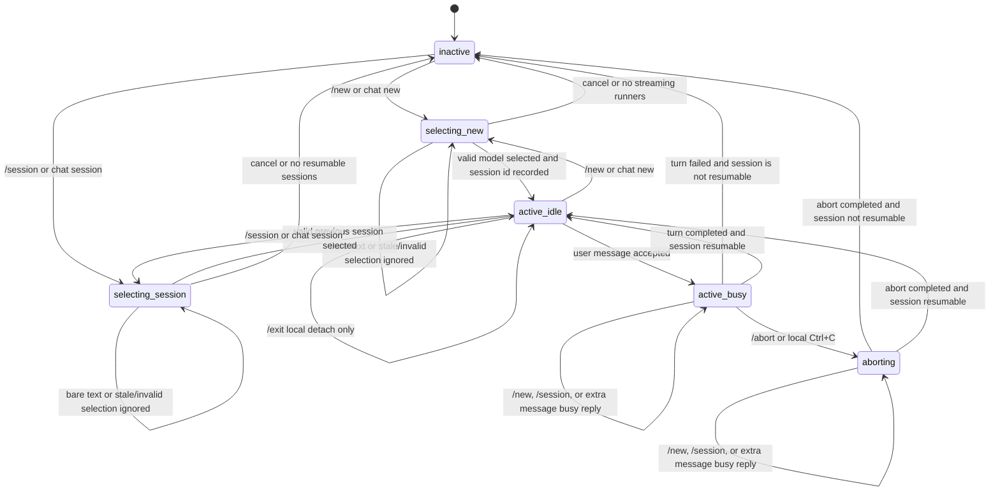

# Chat Bridge

This document is the authoritative design note for TinyButler's interactive chat bridge behavior, state machine, and adapter architecture.

## Goal

TinyButler supports an interactive chat bridge that lets the configured Telegram chat or local CLI talk directly to a long-lived code-agent session, such as Codex or Gemini.

## Local REPL Behavior

`tinybutler chat new` starts a REPL-like interface. It first lets the user choose one streaming-capable model, then each subsequent user line is redirected to that code-agent session and the model response is streamed back.

`tinybutler chat session` lists previous chat sessions with runner, session id or thread id, last activity, and a short title or latest user message when available. After selection, it resumes that session in the same REPL interface.

The local REPL exits on `/exit`. `/exit` detaches from the chat session without aborting or deleting it.

Ctrl+C inside the REPL must immediately abort the active code-agent turn.

Do not add separate local `chat send`, `chat status`, or `chat close` commands for the MVP.

## Telegram Behavior

Telegram command mapping, authorization, bot menu registration, and polling are owned by [telegram-ingress.md](telegram-ingress.md).

| Local CLI | Telegram | Meaning |
| --- | --- | --- |
| `tinybutler chat new` | `/new` | Start a new interactive chat session after model selection |
| `tinybutler chat session` | `/session` | Resume a previous interactive chat session after selection |
| Ctrl+C inside chat REPL | `/abort` | Abort the active code-agent turn |

`/new` should return an inline menu containing only streaming-capable runners, as defined by [configuration.md](configuration.md).

Selecting a model starts a fresh Telegram chat bridge session.

`/session` should return an inline menu of previous chat sessions and resume the selected session as the active Telegram chat bridge session.

After a session is active, non-command Telegram text in the authorized main chat is redirected to that session instead of being ignored.

Bare text remains ignored when no active chat bridge session exists.

Telegram `/abort` must immediately terminate the active code-agent turn, matching local Ctrl+C.

Telegram does not need an explicit exit command for the MVP. The active session remains until replaced by `/new` or `/session`, daemon restart recovery, or invalid session detection.

## Streaming Delivery

When a redirected user message is accepted, TinyButler should acknowledge the Telegram message with a check mark reaction when Telegram supports reactions. If reactions fail, continue without failing the turn.

While the code agent is running, TinyButler should keep sending Telegram `typing` chat actions until the turn completes.

TinyButler should stream code-agent output back to Telegram as the model produces it, using throttled message edits for growing assistant text.

While the model is producing thinking output, Telegram should show `thinking...` and add one more dot for each additional 100 thinking characters received.

Avoid one Telegram API call per token. If message edits fail, fall back to sending a new converted Markdown message through the shared Telegram delivery path.

If a session is already busy, the MVP should reject a second user message with a clear busy response instead of queuing multiple turns.

## Output Rules

Streaming progress may show partial assistant-visible text while a turn is running.

When a valid `<final>` block arrives, TinyButler should fold the previous streaming message into an expandable Telegram block and show the final answer as the visible result.

Final-message folding should cover earlier `<think>`, `<thinking>`, `<thought>`, `<antthinking>`, and `antml:` sections.

Final-message folding must not reinterpret those tags inside fenced code blocks when the model is intentionally showing code.

Raw tool output must not be merged into the main final answer by default. Tool or command output can be used for progress or debug previews, but the final user-facing message should come from assistant-visible text plus attachment delivery results.

Markdown conversion, large-output handling, and `ATTACH:` attachment directives are owned by [markdown-message.md](markdown-message.md).

On adapter error, timeout, or nonzero exit, TinyButler must clear busy state, persist the error, and send a concise failure message.

## Transport Instructions

Chat bridge instructions given to Codex or future adapters must be transport-specific.

Telegram-created or explicitly Telegram-resumed sessions should tell the model that it is behind TinyButler's Telegram bridge, must not expose chain-of-thought, and should either call `tinybutler telegram --attachment <path>` directly or include `ATTACH:<path>` on its own line when it creates an image, screenshot, or other artifact for the user.

Local CLI-created or explicitly CLI-resumed sessions should tell the model it is in the local TinyButler REPL, must not expose chain-of-thought, and should print local file paths for artifacts instead of assuming Telegram delivery.

Ordinary Telegram bare-message turns should not re-inject transport instructions on every technical thread resume. The active session context should already carry them from `/new` or `/session`.

## Abort Semantics

`/abort` and local Ctrl+C cancel only the in-flight user turn and child process or request.

Abort does not delete or close the session.

After abort completes, the session returns to `active_idle` if the adapter confirms it is still resumable. Otherwise TinyButler moves to `inactive` and persists the error.

## Chat State and Locking

Store chat bridge runtime state separately from task `state.json`, for example under `~/.tinybutler/chat_state.json`.

`chat_state.json` is runtime-owned and should include active runner, known sessions, session id or thread id, busy state, last activity, current process or request id, last error, and enough metadata to resume or detach safely.

Write `chat_state.json` atomically through a temp-file rename under a chat lock.

Store metadata only: active runner, session ids, state, timestamps, current process or request id, last error, and session summaries. Do not store full transcripts unless explicitly added later.

Use a chat-state lock file, for example `~/.tinybutler/chat.lock`, to serialize all chat bridge mutations across daemon and local CLI processes.

Only one active turn may exist per TinyButler home. A competing local REPL, Telegram turn, or second daemon instance must receive a busy or locked response.

On startup or before handling a chat command, if `chat_state.json` says a session is busy, TinyButler must verify the recorded process or request is still alive.

If the recorded busy process is not alive, mark the turn failed or aborted, clear busy state, persist `last_error`, and keep the last resumable session id when valid.

## State Machine

State values are `inactive`, `selecting_new`, `selecting_session`, `active_idle`, `active_busy`, and `aborting`.

`/new` and `/session` may replace the active chat only from `inactive` or `active_idle`. While `active_busy` or `aborting`, they must return a busy response and must not mutate state.

Bare Telegram text is accepted only in `active_idle`, where it starts a turn and moves to `active_busy`. Bare Telegram text while `inactive`, `selecting_new`, or `selecting_session` is ignored or answered with a short instruction to choose from the menu.

Local REPL user input is accepted only after model or session selection has completed.

Ctrl+C moves `active_busy` to `aborting`; `/exit` detaches without changing the resumable session metadata.

Stale inline selections, runner removal after menu render, deleted menu messages, and invalid session ids must be rejected without changing state.

TinyButler records a session only after the adapter returns a stable session or thread id.

Sessions with no stable id are not listed.

Aborted or failed turns remain resumable only if the adapter confirms the session id is valid.

## ChatAgent Adapter Architecture

TinyButler implements the chat bridge inside the Rust daemon with `teloxide` plus `codex-codes`.

This MVP architecture preserves one config file, one daemon, one Telegram ingress path, and the CLI-first command model.

Use `codex-codes` for Codex app-server JSON-RPC streaming, multi-turn threads, approval requests, and event parsing, pinned behind a `ChatAgent` trait.

The `ChatAgent` trait should model starting a session, listing resumable sessions, resuming a selected session, sending one user turn, streaming assistant/tool events, and aborting the active turn.

Gemini and future Claude support need separate adapters behind the same `ChatAgent` boundary.
